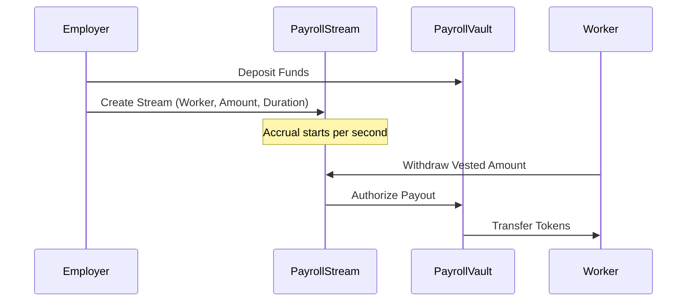

# API Documentation

This document describes the interaction between the Quipay frontend and smart contracts, as well as the planned backend AI agent APIs.

## 🔗 Client Bindings

Quipay uses automatically generated TypeScript bindings for Soroban contracts. These are available in the `src/contracts` directory (or through the `npm run dev` environment).

### Usage Example

```typescript
import { PayrollStream } from "./contracts/payroll_stream";

const streamClient = new PayrollStream({
  // configuration
});

async function createNewStream(worker, amount) {
  const tx = await streamClient.create_stream({
    employer: myAddress,
    worker: worker,
    amount: BigInt(amount),
    start_ts: BigInt(Date.now() / 1000),
    end_ts: BigInt(Date.now() / 1000 + 2592000), // 30 days
  });

  const { result } = await tx.signAndSend();
  return result;
}
```

## 🌊 Streaming Flow



## 🤖 AI Agent API (Planned)

The Quipay backend will host AI agents that monitor treasury solvency and automate payroll scheduling.

### Endpoints

#### `POST /api/v1/agents/schedule`

Schedules a payroll run based on workforce data.

#### `GET /api/v1/treasury/status`

Checks treasury health against projected liabilities.

#### `POST /api/v1/automation/execute`

Triggers an authorized action through the `AutomationGateway` contract.

---

## 🛡️ Solvency Invariant

The protocol enforces the following invariant on-chain:

`Total Treasury Balance >= Sum(All Active Streams' Total Remaining Amounts)`

This ensures that once a stream is created, the funds are guaranteed to be available for the entire duration.
