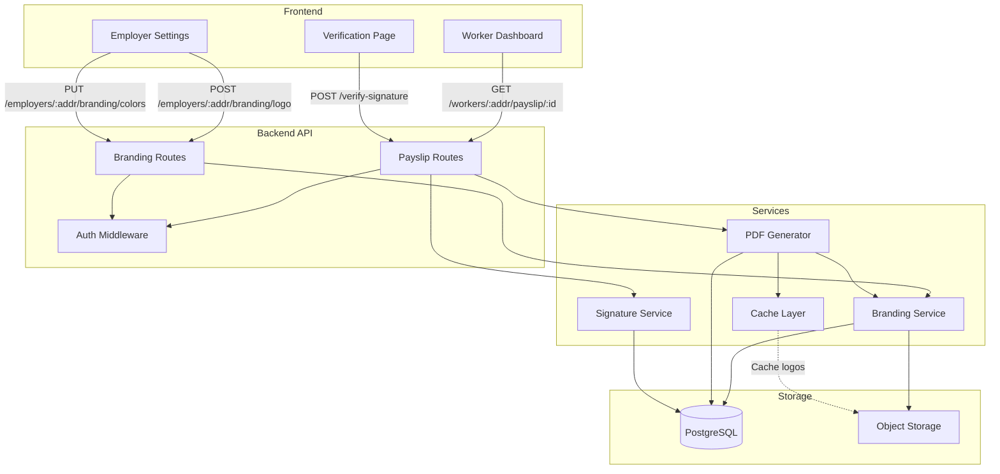

# Design Document: Invoice Generation and PDF Payslip Export

## Overview

This feature implements a comprehensive PDF payslip generation system that allows workers to download professional payslips for their payment streams. The system supports employer branding (logos and colors) and includes cryptographic signatures for authenticity verification.

The design follows a layered architecture with clear separation between:

- Backend API endpoints for payslip generation and branding management
- PDF generation service with template rendering
- Storage layer for employer branding assets and payslip records
- Frontend components for user interaction
- Cryptographic signing service for document authenticity

Key design goals:

- Generate professional, printable PDF payslips within 3 seconds
- Support employer branding customization (logos, colors)
- Provide cryptographic signatures for authenticity verification
- Maintain audit trail of all generated payslips
- Ensure secure handling of employer branding assets

## Architecture

### System Components



````

### Data Flow

1. **Payslip Generation Flow**:
   - Worker requests payslip via frontend button click
   - Frontend calls GET `/api/workers/:address/payslip/:streamId`
   - Backend authenticates request and validates authorization
   - System checks if payslip already exists in database
   - If exists, return cached PDF; if not, proceed to generation
   - Fetch stream data from database
   - Fetch employer branding settings (logo, colors)
   - Generate PDF using template with stream data and branding
   - Create cryptographic signature of payslip data
   - Store payslip record in database
   - Return PDF to client with appropriate headers

2. **Branding Upload Flow**:
   - Employer uploads logo via settings page
   - Frontend calls POST `/api/employers/:address/branding/logo`
   - Backend validates file type and size
   - Upload file to object storage (S3)
   - Store logo URL and metadata in database
   - Invalidate branding cache
   - Return success response with logo URL

3. **Signature Verification Flow**:
   - User submits signature via verification page
   - Frontend calls POST `/api/verify-signature`
   - Backend looks up payslip by signature
   - Verify signature against stored payslip data
   - Return verification result with payslip details

### Technology Stack

- **PDF Generation**: PDFKit (Node.js library for PDF generation)
- **Object Storage**: AWS S3 or compatible service for logo storage
- **Cryptography**: Node.js crypto module with Ed25519 signatures
- **Caching**: Redis for branding settings and logo URLs
- **Database**: PostgreSQL for payslip records and branding metadata
- **Frontend**: React with TypeScript for UI components

## Components and Interfaces

### Backend API Endpoints

#### 1. Payslip Generation Endpoint

```typescript
GET /api/workers/:address/payslip/:streamId

Headers:
  Authorization: Bearer <token>

Response (200 OK):
  Content-Type: application/pdf
  Content-Disposition: attachment; filename="payslip-{streamId}-{timestamp}.pdf"
  X-Payslip-ID: <unique-id>
  X-Signature: <cryptographic-signature>

  <PDF binary data>

Response (403 Forbidden):
  {
    "error": "Unauthorized access to payslip"
  }

Response (404 Not Found):
  {
    "error": "Stream not found"
  }

Response (500 Internal Server Error):
  {
    "error": "PDF generation failed",
    "details": "<error message>"
  }
````

#### 2. Logo Upload Endpoint

```typescript
POST /api/employers/:address/branding/logo

Headers:
  Authorization: Bearer <token>
  Content-Type: multipart/form-data

Body:
  logo: <image file>

Response (200 OK):
  {
    "logoUrl": "https://storage.example.com/logos/employer-123.png",
    "metadata": {
      "size": 245678,
      "format": "png",
      "uploadedAt": "2024-01-15T10:30:00Z"
    }
  }

Response (400 Bad Request):
  {
    "error": "Invalid file format or size"
  }

Response (401 Unauthorized):
  {
    "error": "Authentication required"
  }
```

#### 3. Brand Colors Endpoint

```typescript
PUT /api/employers/:address/branding/colors

Headers:
  Authorization: Bearer <token>
  Content-Type: application/json

Body:
  {
    "primaryColor": "#2563eb",
    "secondaryColor": "#64748b"
  }

Response (200 OK):
  {
    "primaryColor": "#2563eb",
    "secondaryColor": "#64748b",
    "updatedAt": "2024-01-15T10:30:00Z"
  }

Response (400 Bad Request):
  {
    "error": "Invalid hex color format"
  }
```

#### 4. Get Branding Settings Endpoint

```typescript
GET /api/employers/:address/branding

Headers:
  Authorization: Bearer <token>

Response (200 OK):
  {
    "employerAddress": "GAXXX...",
    "logoUrl": "https://storage.example.com/logos/employer-123.png",
    "primaryColor": "#2563eb",
    "secondaryColor": "#64748b",
    "updatedAt": "2024-01-15T10:30:00Z"
  }

Response (404 Not Found):
  {
    "employerAddress": "GAXXX...",
    "logoUrl": null,
    "primaryColor": "#2563eb",
    "secondaryColor": "#64748b"
  }
```

#### 5. Signature Verification Endpoint

```typescript
POST /api/verify-signature

Headers:
  Content-Type: application/json

Body:
  {
    "signature": "<signature-string>"
  }

Response (200 OK):
  {
    "valid": true,
    "payslip": {
      "id": "payslip-123",
      "streamId": 456,
      "workerAddress": "GAXXX...",
      "employerAddress": "GAXXX...",
      "generatedAt": "2024-01-15T10:30:00Z"
    }
  }

Response (200 OK - Invalid):
  {
    "valid": false,
    "message": "Signature is invalid or payslip has been tampered with"
  }

Response (404 Not Found):
  {
    "valid": false,
    "message": "Signature not found in system"
  }
```

### Service Layer Interfaces

#### PDF Generator Service

```typescript
interface PDFGeneratorService {
  /**
   * Generate a PDF payslip for a given stream
   */
  generatePayslip(params: {
    streamId: number;
    streamData: StreamRecord;
    withdrawals: WithdrawalRecord[];
    branding: BrandingSettings;
    signature: string;
  }): Promise<Buffer>;

  /**
   * Generate a preview of how a payslip will look with given branding
   */
  generatePreview(params: { branding: BrandingSettings }): Promise<Buffer>;
}

interface StreamRecord {
  stream_id: number;
  employer: string;
  worker: string;
  total_amount: string;
  withdrawn_amount: string;
  start_ts: number;
  end_ts: number;
  status: string;
  created_at: Date;
}

interface WithdrawalRecord {
  id: number;
  stream_id: number;
  worker: string;
  amount: string;
  ledger: number;
  ledger_ts: number;
  created_at: Date;
}

interface BrandingSettings {
  logoUrl: string | null;
  primaryColor: string;
  secondaryColor: string;
}
```

#### Branding Service

```typescript
interface BrandingService {
  /**
   * Upload and store employer logo
   */
  uploadLogo(params: {
    employerAddress: string;
    file: Buffer;
    filename: string;
    mimeType: string;
  }): Promise<{
    logoUrl: string;
    metadata: LogoMetadata;
  }>;

  /**
   * Update employer brand colors
   */
  updateColors(params: {
    employerAddress: string;
    primaryColor: string;
    secondaryColor: string;
  }): Promise<BrandingSettings>;

  /**
   * Get employer branding settings (with caching)
   */
  getBranding(employerAddress: string): Promise<BrandingSettings>;

  /**
   * Delete employer logo
   */
  deleteLogo(employerAddress: string): Promise<void>;

  /**
   * Validate image file
   */
  validateImageFile(
    file: Buffer,
    mimeType: string,
  ): Promise<{
    valid: boolean;
    error?: string;
  }>;
}

interface LogoMetadata {
  size: number;
  format: string;
  uploadedAt: Date;
  dimensions?: {
    width: number;
    height: number;
  };
}
```

#### Signature Service

```typescript
interface SignatureService {
  /**
   * Generate cryptographic signature for payslip data
   */
  signPayslip(params: {
    payslipId: string;
    streamId: number;
    workerAddress: string;
    employerAddress: string;
    totalAmount: string;
    generatedAt: Date;
  }): Promise<string>;

  /**
   * Verify a payslip signature
   */
  verifySignature(params: {
    signature: string;
    payslipData: PayslipData;
  }): Promise<boolean>;

  /**
   * Generate QR code for signature
   */
  generateQRCode(signature: string): Promise<Buffer>;
}

interface PayslipData {
  payslipId: string;
  streamId: number;
  workerAddress: string;
  employerAddress: string;
  totalAmount: string;
  generatedAt: Date;
}
```

### Frontend Components

#### PayslipDownloadButton Component

```typescript
interface PayslipDownloadButtonProps {
  streamId: number;
  workerAddress: string;
  className?: string;
  onSuccess?: () => void;
  onError?: (error: Error) => void;
}

/**
 * Button component for downloading payslips
 * Handles API call, loading state, and error display
 */
export const PayslipDownloadButton: React.FC<PayslipDownloadButtonProps>;
```

#### BrandingSettings Component

```typescript
interface BrandingSettingsProps {
  employerAddress: string;
  onSave?: (settings: BrandingSettings) => void;
}

/**
 * Component for managing employer branding settings
 * Includes logo upload, color pickers, and preview
 */
export const BrandingSettings: React.FC<BrandingSettingsProps>;
```

#### SignatureVerification Component

```typescript
interface SignatureVerificationProps {
  onVerificationComplete?: (result: VerificationResult) => void;
}

interface VerificationResult {
  valid: boolean;
  payslip?: PayslipData;
  message: string;
}

/**
 * Component for verifying payslip signatures
 * Includes input form and result display
 */
export const SignatureVerification: React.FC<SignatureVerificationProps>;
```

## Data Models

### Database Schema

#### employer_branding Table

```sql
CREATE TABLE employer_branding (
  id SERIAL PRIMARY KEY,
  employer_address VARCHAR(56) NOT NULL UNIQUE,
  logo_url TEXT,
  logo_metadata JSONB,
  primary_color VARCHAR(7) NOT NULL DEFAULT '#2563eb',
  secondary_color VARCHAR(7) NOT NULL DEFAULT '#64748b',
  created_at TIMESTAMP NOT NULL DEFAULT NOW(),
  updated_at TIMESTAMP NOT NULL DEFAULT NOW(),

  CONSTRAINT valid_hex_primary CHECK (primary_color ~ '^#[0-9A-Fa-f]{6}$'),
  CONSTRAINT valid_hex_secondary CHECK (secondary_color ~ '^#[0-9A-Fa-f]{6}$')
);

CREATE INDEX idx_employer_branding_address ON employer_branding(employer_address);
```

#### payslip_records Table

```sql
CREATE TABLE payslip_records (
  id SERIAL PRIMARY KEY,
  payslip_id VARCHAR(64) NOT NULL UNIQUE,
  stream_id INTEGER NOT NULL,
  worker_address VARCHAR(56) NOT NULL,
  employer_address VARCHAR(56) NOT NULL,
  signature TEXT NOT NULL,
  branding_snapshot JSONB NOT NULL,
  pdf_url TEXT,
  generated_at TIMESTAMP NOT NULL DEFAULT NOW(),

  CONSTRAINT fk_stream FOREIGN KEY (stream_id)
    REFERENCES payroll_streams(stream_id) ON DELETE CASCADE
);

CREATE INDEX idx_payslip_stream ON payslip_records(stream_id);
CREATE INDEX idx_payslip_worker ON payslip_records(worker_address);
CREATE INDEX idx_payslip_employer ON payslip_records(employer_address);
CREATE INDEX idx_payslip_signature ON payslip_records(signature);
CREATE INDEX idx_payslip_generated_at ON payslip_records(generated_at);
```

### Data Models

#### BrandingSettings Model

```typescript
interface BrandingSettings {
  employerAddress: string;
  logoUrl: string | null;
  logoMetadata: {
    size: number;
    format: string;
    uploadedAt: Date;
    dimensions?: {
      width: number;
      height: number;
    };
  } | null;
  primaryColor: string;
  secondaryColor: string;
  createdAt: Date;
  updatedAt: Date;
}
```

#### PayslipRecord Model

```typescript
interface PayslipRecord {
  id: number;
  payslipId: string;
  streamId: number;
  workerAddress: string;
  employerAddress: string;
  signature: string;
  brandingSnapshot: BrandingSettings;
  pdfUrl: string | null;
  generatedAt: Date;
}
```

#### PayslipData Model (for PDF generation)

```typescript
interface PayslipData {
  payslipId: string;
  streamId: number;
  worker: {
    address: string;
  };
  employer: {
    address: string;
    businessName?: string;
  };
  stream: {
    totalAmount: string;
    withdrawnAmount: string;
    startDate: Date;
    endDate: Date;
    status: string;
  };
  withdrawals: Array<{
    amount: string;
    date: Date;
    ledger: number;
  }>;
  branding: BrandingSettings;
  signature: string;
  qrCode: Buffer;
  generatedAt: Date;
}
```

## Correctness Properties

_A property is a characteristic or behavior that should hold true across all valid executions of a system—essentially, a formal statement about what the system should do. Properties serve as the bridge between human-readable specifications and machine-verifiable correctness guarantees._

### Property Reflection

After analyzing all acceptance criteria, I identified the following consolidation opportunities:

**Redundancy Analysis:**

- Properties 1.3 and 1.4 (PDF contains required fields) can be combined into a single comprehensive property about PDF content completeness
- Properties 4.2 and 4.3 (logo and color application) can be combined into a single property about branding application
- Properties 7.2, 7.3, and 7.4 (authorization and error responses) represent different cases of the same authorization property
- Properties 10.2, 10.3, 10.4, and 10.5 (button behavior) can be consolidated into properties about component state management
- Properties 12.2 and 12.3 (fallback behaviors) are both edge cases of graceful degradation

**Consolidated Properties:**
The following properties represent the minimal set needed to verify all testable requirements without redundancy.

### Property 1: PDF Content Completeness

_For any_ stream with associated withdrawal data, when a payslip PDF is generated, the PDF SHALL contain all required fields: worker address, employer address, total amount, withdrawn amount, stream period (start and end timestamps), withdrawal history, unique payslip ID, generation timestamp, and signature.

**Validates: Requirements 1.3, 1.4**

### Property 2: Filename Format Consistency

_For any_ stream ID and generation timestamp, when a payslip PDF is downloaded, the filename SHALL match the pattern `payslip-{streamId}-{timestamp}.pdf` where streamId is a positive integer and timestamp is in ISO 8601 format.

**Validates: Requirements 1.5**

### Property 3: Image File Validation

_For any_ file upload to the logo endpoint, the system SHALL accept files with MIME types image/png, image/jpeg, or image/svg+xml that are under 2MB in size, and SHALL reject all other files with appropriate error messages.

**Validates: Requirements 2.2**

### Property 4: Logo Storage and Association

_For any_ valid logo upload by an employer, the system SHALL store the logo in object storage, create a database record associating the logo URL with the employer's address, and return the logo URL in the response.

**Validates: Requirements 2.3**

### Property 5: Logo Replacement

_For any_ employer with an existing logo, when a new logo is uploaded, the system SHALL replace the old logo URL with the new one, ensuring only one logo is associated with the employer at any time.

**Validates: Requirements 2.4**

### Property 6: Logo Removal Round-Trip

_For any_ employer with a logo, when the logo is removed, subsequent branding queries SHALL return null for logoUrl, and generated payslips SHALL use default styling without custom branding.

**Validates: Requirements 2.6**

### Property 7: Hex Color Validation

_For any_ color input to the branding colors endpoint, the system SHALL accept strings matching the pattern `^#[0-9A-Fa-f]{6}$` and SHALL reject all other strings with a validation error.

**Validates: Requirements 3.2**

### Property 8: Color Persistence and Retrieval

_For any_ valid brand colors saved by an employer, subsequent GET requests to the branding endpoint SHALL return those exact color values, and payslips generated after the save SHALL use those colors.

**Validates: Requirements 3.3**

### Property 9: Branding Application

_For any_ employer with custom branding (logo and/or colors), when a payslip is generated for one of their streams, the PDF SHALL include the employer's logo (if present) and apply the employer's brand colors to the design elements.

**Validates: Requirements 4.2, 4.3**

### Property 10: Signature Generation

_For any_ payslip generation, the system SHALL create a cryptographic signature of the payslip data using Ed25519 or ECDSA, and the generated PDF SHALL include both a QR code representation and text string of the signature.

**Validates: Requirements 5.1, 5.2, 5.3**

### Property 11: Signature Verification Round-Trip

_For any_ valid payslip signature, when submitted to the verification endpoint, the system SHALL return valid=true and include the original payslip details (stream ID, worker address, employer address, generation timestamp).

**Validates: Requirements 6.2, 6.3**

### Property 12: Invalid Signature Detection

_For any_ signature that does not match stored payslip data or has been tampered with, the verification endpoint SHALL return valid=false with a warning message about potential fraud.

**Validates: Requirements 6.4**

### Property 13: Authentication Enforcement

_For any_ request to payslip or branding endpoints without valid authentication, the system SHALL return a 401 Unauthorized error before processing the request.

**Validates: Requirements 7.1, 8.6**

### Property 14: Authorization Enforcement

_For any_ authenticated request to GET `/api/workers/:address/payslip/:streamId`, the system SHALL return a 403 Forbidden error if the authenticated user's address does not match the worker address parameter, and SHALL generate and return a PDF if the addresses match.

**Validates: Requirements 7.2, 7.3**

### Property 15: Stream Existence Validation

_For any_ request to generate a payslip with a stream ID that does not exist in the database, the system SHALL return a 404 Not Found error.

**Validates: Requirements 7.4**

### Property 16: PDF Response Headers

_For any_ successful payslip generation, the HTTP response SHALL include Content-Type: application/pdf, Content-Disposition header with the correct filename, X-Payslip-ID header, and X-Signature header.

**Validates: Requirements 7.6**

### Property 17: Branding API Response Completeness

_For any_ successful logo upload, the response SHALL include logoUrl and metadata fields; for any successful color update, the response SHALL include primaryColor, secondaryColor, and updatedAt fields; for any GET branding request, the response SHALL include all branding settings.

**Validates: Requirements 8.2, 8.4, 8.5**

### Property 18: Payslip Record Persistence

_For any_ payslip generation, the system SHALL create a database record containing stream_id, payslip_id, worker_address, employer_address, signature, branding_snapshot (the branding settings used), and generated_at timestamp.

**Validates: Requirements 9.1, 9.2**

### Property 19: Payslip Idempotency

_For any_ stream ID, when a payslip is requested multiple times, the system SHALL return the existing payslip record from the database rather than regenerating it, ensuring the same payslip_id and signature are returned.

**Validates: Requirements 9.3**

### Property 20: Payslip Query Filtering

_For any_ query to the payslip records table with filters for worker_address, employer_address, or date range, the system SHALL return only records matching all specified filters.

**Validates: Requirements 9.4**

### Property 21: Soft-Delete Preservation

_For any_ stream that is soft-deleted, all associated payslip records SHALL remain in the database and be retrievable for audit purposes.

**Validates: Requirements 9.5**

### Property 22: Component State Transitions

_For any_ PayslipDownloadButton component, when clicked, the component SHALL transition through states: idle → loading → (success | error) → idle, calling the API endpoint during the loading state and displaying appropriate feedback in success or error states.

**Validates: Requirements 10.2, 10.3, 10.4, 10.5**

### Property 23: Branding Preview Reactivity

_For any_ change to logo or colors in the BrandingSettings component, the preview SHALL update to reflect the new branding within the same render cycle.

**Validates: Requirements 11.2, 11.3**

### Property 24: Branding Save Operation

_For any_ save action in the BrandingSettings component, the component SHALL call the appropriate branding API endpoint (logo upload or color update) and display success or error feedback based on the response.

**Validates: Requirements 11.4**

### Property 25: Error Logging Completeness

_For any_ error during PDF generation, the system SHALL log an entry containing at minimum: error message, stream_id, user identifier, timestamp, and stack trace.

**Validates: Requirements 12.1**

### Property 26: Metrics Emission

_For any_ error in the payslip generation or branding upload flow, the system SHALL emit a metric event to the monitoring system with error type, endpoint, and timestamp.

**Validates: Requirements 12.5**

## Error Handling

### Error Categories and Handling Strategies

#### 1. Validation Errors (4xx)

**File Upload Validation**

- Invalid file format → 400 Bad Request with message "File must be PNG, JPG, or SVG"
- File too large → 400 Bad Request with message "File size must be under 2MB"
- Missing file → 400 Bad Request with message "Logo file is required"

**Color Validation**

- Invalid hex format → 400 Bad Request with message "Color must be valid hex format (#RRGGBB)"
- Missing required fields → 400 Bad Request with field-specific error messages

**Stream Validation**

- Stream not found → 404 Not Found with message "Stream does not exist"
- Invalid stream ID format → 400 Bad Request with message "Stream ID must be a positive integer"

#### 2. Authorization Errors (401, 403)

**Authentication Failures**

- Missing token → 401 Unauthorized with message "Authentication required"
- Invalid token → 401 Unauthorized with message "Invalid authentication token"
- Expired token → 401 Unauthorized with message "Authentication token expired"

**Authorization Failures**

- Worker address mismatch → 403 Forbidden with message "Unauthorized access to payslip"
- Employer address mismatch → 403 Forbidden with message "Unauthorized access to branding settings"

#### 3. Service Errors (5xx)

**PDF Generation Failures**

- PDFKit exception → 500 Internal Server Error
  - Log full error with context
  - Return user-friendly message: "Failed to generate PDF. Please try again."
  - Emit metric: `payslip.generation.error`

**Storage Failures**

- S3 upload failure → 500 Internal Server Error
  - Retry up to 3 times with exponential backoff
  - Log error with employer address and file details
  - Return message: "Failed to upload logo. Please try again."
  - Emit metric: `branding.upload.error`

**Database Failures**

- Connection timeout → 500 Internal Server Error
  - Retry query once
  - Log error with query details
  - Return message: "Database temporarily unavailable"
  - Emit metric: `database.error`

**Signature Generation Failures**

- Crypto library exception → Log warning, continue without signature
  - Generate PDF with warning text: "Signature unavailable"
  - Log error with full context
  - Emit metric: `signature.generation.error`
  - Do not fail the entire payslip generation

#### 4. Graceful Degradation

**Logo Retrieval Failure**

- If logo URL is stored but file cannot be retrieved from S3:
  - Log warning with employer address and logo URL
  - Generate payslip without logo using default styling
  - Do not fail the entire generation
  - Emit metric: `branding.logo.retrieval.error`

**Branding Settings Unavailable**

- If branding query fails:
  - Log error
  - Use default branding (no logo, default colors)
  - Continue with payslip generation
  - Emit metric: `branding.query.error`

### Error Response Format

All API errors follow a consistent JSON structure:

```typescript
interface ErrorResponse {
  error: string; // Human-readable error message
  code?: string; // Machine-readable error code
  details?: Record<string, unknown>; // Additional context
  timestamp: string; // ISO 8601 timestamp
  requestId: string; // For tracing
}
```

Example:

```json
{
  "error": "File size must be under 2MB",
  "code": "FILE_TOO_LARGE",
  "details": {
    "maxSize": 2097152,
    "actualSize": 3145728
  },
  "timestamp": "2024-01-15T10:30:00Z",
  "requestId": "req-abc123"
}
```

### Logging Strategy

**Error Logs Include:**

- Timestamp (ISO 8601)
- Request ID (for correlation)
- User identifier (worker or employer address)
- Error message and stack trace
- Context data (stream ID, file details, etc.)
- Severity level (ERROR, WARN, INFO)

**Log Levels:**

- ERROR: Service failures, unexpected exceptions
- WARN: Graceful degradation events (missing logo, signature failure)
- INFO: Successful operations, validation failures

**Example Log Entry:**

```json
{
  "level": "ERROR",
  "timestamp": "2024-01-15T10:30:00Z",
  "requestId": "req-abc123",
  "userId": "GAXXX...",
  "streamId": 456,
  "error": "PDF generation failed",
  "message": "PDFKit threw exception during rendering",
  "stack": "Error: ...",
  "context": {
    "hasLogo": true,
    "brandingColors": { "primary": "#2563eb", "secondary": "#64748b" }
  }
}
```

### Monitoring and Alerting

**Metrics to Track:**

- `payslip.generation.success` (counter)
- `payslip.generation.error` (counter)
- `payslip.generation.duration` (histogram)
- `branding.upload.success` (counter)
- `branding.upload.error` (counter)
- `signature.generation.error` (counter)
- `signature.verification.success` (counter)
- `signature.verification.failure` (counter)

**Alert Thresholds:**

- Error rate > 5% over 5 minutes → Page on-call
- PDF generation p95 latency > 5 seconds → Warning
- Signature generation failure rate > 1% → Warning
- Storage upload failure rate > 2% → Warning

## Testing Strategy

### Overview

This feature requires a dual testing approach combining unit tests for specific examples and edge cases with property-based tests for universal properties. Property-based tests will use **fast-check** (for TypeScript/JavaScript) to generate random inputs and verify properties hold across all cases.

### Property-Based Testing

**Library**: fast-check (npm package)

**Configuration**:

- Minimum 100 iterations per property test
- Each test tagged with feature name and property number
- Tag format: `Feature: invoice-generation-and-pdf-payslip-export, Property {N}: {description}`

**Property Test Examples**:

#### Property 1: PDF Content Completeness

```typescript
import fc from "fast-check";

describe("Feature: invoice-generation-and-pdf-payslip-export, Property 1: PDF Content Completeness", () => {
  it("should include all required fields in generated PDF", async () => {
    await fc.assert(
      fc.asyncProperty(
        fc.record({
          streamId: fc.integer({ min: 1 }),
          workerAddress: fc.string({ minLength: 56, maxLength: 56 }),
          employerAddress: fc.string({ minLength: 56, maxLength: 56 }),
          totalAmount: fc.bigInt({ min: 1n }),
          withdrawnAmount: fc.bigInt({ min: 0n }),
          startTs: fc.integer({ min: 1 }),
          endTs: fc.integer({ min: 1 }),
        }),
        fc.array(
          fc.record({
            amount: fc.bigInt({ min: 1n }),
            ledgerTs: fc.integer({ min: 1 }),
          }),
        ),
        async (streamData, withdrawals) => {
          const pdf = await pdfGenerator.generatePayslip({
            streamId: streamData.streamId,
            streamData,
            withdrawals,
            branding: defaultBranding,
            signature: "test-signature",
          });

          const pdfText = await extractTextFromPDF(pdf);

          // Verify all required fields are present
          expect(pdfText).toContain(streamData.workerAddress);
          expect(pdfText).toContain(streamData.employerAddress);
          expect(pdfText).toContain(streamData.totalAmount.toString());
          expect(pdfText).toContain(streamData.withdrawnAmount.toString());
          expect(pdfText).toMatch(/Payslip ID:/);
          expect(pdfText).toMatch(/Generated:/);
          expect(pdfText).toContain("test-signature");
        },
      ),
      { numRuns: 100 },
    );
  });
});
```

#### Property 7: Hex Color Validation

```typescript
describe("Feature: invoice-generation-and-pdf-payslip-export, Property 7: Hex Color Validation", () => {
  it("should accept valid hex colors and reject invalid ones", async () => {
    await fc.assert(
      fc.asyncProperty(
        fc.hexaString({ minLength: 6, maxLength: 6 }),
        async (hexColor) => {
          const color = `#${hexColor}`;
          const result = await brandingService.updateColors({
            employerAddress: "GAXXX...",
            primaryColor: color,
            secondaryColor: "#64748b",
          });

          expect(result.primaryColor).toBe(color);
        },
      ),
      { numRuns: 100 },
    );

    // Test rejection of invalid colors
    await fc.assert(
      fc.asyncProperty(
        fc.string().filter((s) => !/^#[0-9A-Fa-f]{6}$/.test(s)),
        async (invalidColor) => {
          await expect(
            brandingService.updateColors({
              employerAddress: "GAXXX...",
              primaryColor: invalidColor,
              secondaryColor: "#64748b",
            }),
          ).rejects.toThrow(/invalid.*hex/i);
        },
      ),
      { numRuns: 100 },
    );
  });
});
```

#### Property 11: Signature Verification Round-Trip

```typescript
describe("Feature: invoice-generation-and-pdf-payslip-export, Property 11: Signature Verification Round-Trip", () => {
  it("should verify signatures for any valid payslip data", async () => {
    await fc.assert(
      fc.asyncProperty(
        fc.record({
          payslipId: fc.uuid(),
          streamId: fc.integer({ min: 1 }),
          workerAddress: fc.string({ minLength: 56, maxLength: 56 }),
          employerAddress: fc.string({ minLength: 56, maxLength: 56 }),
          totalAmount: fc.bigInt({ min: 1n }).map((n) => n.toString()),
          generatedAt: fc.date(),
        }),
        async (payslipData) => {
          // Generate signature
          const signature = await signatureService.signPayslip(payslipData);

          // Store payslip record
          await db.insertPayslipRecord({
            ...payslipData,
            signature,
          });

          // Verify signature
          const result = await signatureService.verifySignature({
            signature,
            payslipData,
          });

          expect(result).toBe(true);
        },
      ),
      { numRuns: 100 },
    );
  });
});
```

#### Property 19: Payslip Idempotency

```typescript
describe("Feature: invoice-generation-and-pdf-payslip-export, Property 19: Payslip Idempotency", () => {
  it("should return same payslip for multiple requests", async () => {
    await fc.assert(
      fc.asyncProperty(fc.integer({ min: 1 }), async (streamId) => {
        // First request
        const payslip1 = await payslipService.getOrGeneratePayslip(streamId);

        // Second request
        const payslip2 = await payslipService.getOrGeneratePayslip(streamId);

        // Should return same payslip ID and signature
        expect(payslip1.payslipId).toBe(payslip2.payslipId);
        expect(payslip1.signature).toBe(payslip2.signature);
        expect(payslip1.generatedAt).toEqual(payslip2.generatedAt);
      }),
      { numRuns: 100 },
    );
  });
});
```

### Unit Testing

Unit tests focus on specific examples, edge cases, and integration points. Avoid writing too many unit tests since property-based tests handle comprehensive input coverage.

**Unit Test Focus Areas**:

1. **Specific Examples**
   - Default branding colors are applied when none set
   - Payslip displays correctly with employer logo
   - Verification page shows correct message for not-found signature

2. **Edge Cases**
   - Empty withdrawal history
   - Logo file retrieval failure (graceful degradation)
   - Signature generation failure (graceful degradation)
   - Very long employer/worker addresses
   - Stream with zero withdrawn amount

3. **Integration Points**
   - API endpoint authentication middleware
   - Database transaction handling
   - S3 upload retry logic
   - Cache invalidation on branding update

**Example Unit Tests**:

```typescript
describe('Payslip Generation - Edge Cases', () => {
  it('should generate payslip without logo when logo retrieval fails', async () => {
    // Mock S3 to throw error
    mockS3.getObject.mockRejectedValue(new Error('Not found'));

    const pdf = await pdfGenerator.generatePayslip({
      streamId: 123,
      streamData: mockStreamData,
      withdrawals: [],
      branding: { logoUrl: 'https://s3.../logo.png', ...defaultColors },
      signature: 'sig',
    });

    expect(pdf).toBeDefined();
    expect(mockLogger.warn).toHaveBeenCalledWith(
      expect.stringContaining('Logo retrieval failed')
    );
  });

  it('should generate payslip without signature when signing fails', async () => {
    mockCrypto.sign.mockImplementation(() => {
      throw new Error('Crypto error');
    });

    const pdf = await pdfGenerator.generatePayslip({
      streamId: 123,
      streamData: mockStreamData,
      withdrawals: [],
      branding: defaultBranding,
      signature: '',
    });

    const pdfText = await extractTextFromPDF(pdf);
    expect(pdfText).toContain('Signature unavailable');
    expect(mockLogger.warn).toHaveBeenCalled();
  });

  it('should use default colors when branding not set', async () => {
    const branding = await brandingService.getBranding('GAXXX...');

    expect(branding.primaryColor).toBe('#2563eb');
    expect(branding.secondaryColor).toBe('#64748b');
    expect(branding.logoUrl).toBeNull();
  });
});

describe('API Endpoints - Authorization', () => {
  it('should return 403 when worker address does not match authenticated user', async () => {
    const response = await request(app)
      .get('/api/workers/GAXXX111/payslip/123')
      .set('Authorization', 'Bearer token-for-GAXXX222');

    expect(response.status).toBe(403);
    expect(response.body.error).toContain('Unauthorized');
  });

  it('should return 404 when stream does not exist', async () => {
    const response = await request(app)
      .get('/api/workers/GAXXX111/payslip/99999')
      .set('Authorization', 'Bearer token-for-GAXXX111');

    expect(response.status).toBe(404);
    expect(response.body.error).toContain('Stream not found');
  });
});

describe('React Components', () => {
  it('should display download button for active stream', () => {
    const { getByText } = render(
      <StreamCard stream={mockActiveStream} />
    );

    expect(getByText('Download Payslip')).toBeInTheDocument();
  });

  it('should show loading state when downloading', async () => {
    const { getByRole, getByText } = render(
      <PayslipDownloadButton streamId={123} workerAddress="GAXXX..." />
    );

    const button = getByRole('button');
    fireEvent.click(button);

    expect(getByText(/loading/i)).toBeInTheDocument();
  });
});
```

### Integration Testing

**Test Scenarios**:

1. **End-to-End Payslip Generation**
   - Worker requests payslip via API
   - System fetches stream data, branding, generates PDF
   - PDF is returned with correct headers
   - Database record is created
   - Subsequent request returns cached payslip

2. **Branding Upload Flow**
   - Employer uploads logo via API
   - File is validated and stored in S3
   - Database record is created
   - Cache is invalidated
   - Subsequent payslip generation includes logo

3. **Signature Verification Flow**
   - Generate payslip with signature
   - Submit signature to verification endpoint
   - Verify correct payslip details are returned
   - Test with tampered signature returns invalid

**Integration Test Example**:

```typescript
describe("Payslip Generation Integration", () => {
  let testDb: TestDatabase;
  let testS3: TestS3;

  beforeAll(async () => {
    testDb = await setupTestDatabase();
    testS3 = await setupTestS3();
  });

  it("should generate and cache payslip end-to-end", async () => {
    // Setup: Create stream in database
    const stream = await testDb.createStream({
      streamId: 123,
      employer: "GAXXX111",
      worker: "GAXXX222",
      totalAmount: "1000000",
      withdrawnAmount: "500000",
      startTs: Date.now() / 1000,
      endTs: Date.now() / 1000 + 86400,
    });

    // Setup: Upload employer logo
    await request(app)
      .post("/api/employers/GAXXX111/branding/logo")
      .set("Authorization", "Bearer employer-token")
      .attach("logo", "test/fixtures/logo.png");

    // First request: Generate payslip
    const response1 = await request(app)
      .get("/api/workers/GAXXX222/payslip/123")
      .set("Authorization", "Bearer worker-token");

    expect(response1.status).toBe(200);
    expect(response1.headers["content-type"]).toBe("application/pdf");
    expect(response1.headers["x-payslip-id"]).toBeDefined();

    const payslipId1 = response1.headers["x-payslip-id"];

    // Second request: Should return cached payslip
    const response2 = await request(app)
      .get("/api/workers/GAXXX222/payslip/123")
      .set("Authorization", "Bearer worker-token");

    expect(response2.status).toBe(200);
    expect(response2.headers["x-payslip-id"]).toBe(payslipId1);

    // Verify database record exists
    const record = await testDb.getPayslipRecord(payslipId1);
    expect(record).toBeDefined();
    expect(record.streamId).toBe(123);
    expect(record.signature).toBeDefined();
  });
});
```

### Test Coverage Goals

- **Unit Test Coverage**: > 80% line coverage
- **Property Test Coverage**: All 26 correctness properties implemented
- **Integration Test Coverage**: All critical user flows covered
- **Edge Case Coverage**: All graceful degradation scenarios tested

### Testing Tools

- **Unit Tests**: Jest
- **Property-Based Tests**: fast-check
- **Integration Tests**: Supertest + Testcontainers (for PostgreSQL)
- **Frontend Tests**: React Testing Library + Jest
- **E2E Tests**: Playwright (optional, for critical flows)

### Continuous Integration

All tests run on every pull request:

1. Unit tests (fast, run first)
2. Property-based tests (100 iterations each)
3. Integration tests (with test database)
4. Linting and type checking

**CI Pipeline**:

```yaml
test:
  - npm run test:unit
  - npm run test:property
  - npm run test:integration
  - npm run lint
  - npm run typecheck
```
