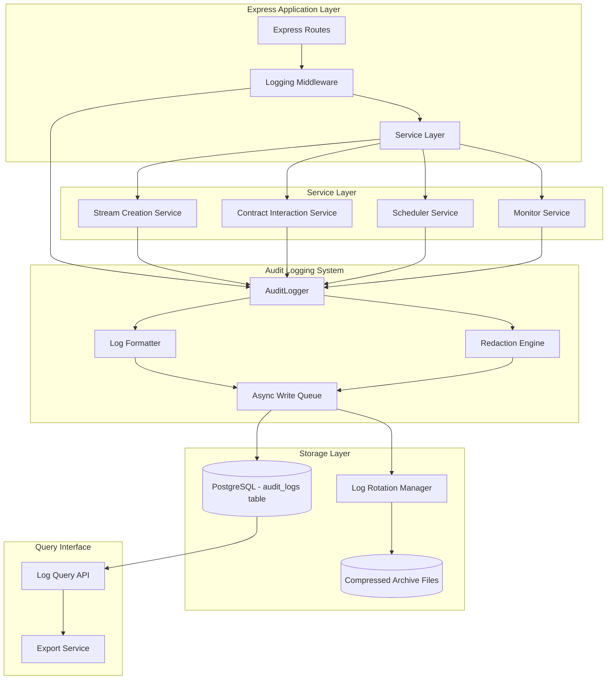

# Design Document: Structured Audit Logging System

## Overview

The Structured Audit Logging System provides comprehensive audit trails for the Quipay backend automation engine. This system captures all automated actions including payroll stream creation, contract interactions, monitoring events, and scheduled tasks in a structured JSON format with persistent, searchable storage.

### Key Design Goals

1. **Structured Logging**: All logs in JSON format for programmatic parsing and analysis
2. **Comprehensive Coverage**: Capture all backend agent actions including stream creation, contract calls, monitoring, and scheduling
3. **Performance**: Asynchronous logging with minimal impact on critical operations (<5ms overhead)
4. **Searchability**: Query logs by timestamp, level, employer, action type
5. **Security**: Automatic redaction of sensitive data (private keys, tokens, seed phrases)
6. **Reliability**: Persistent storage with rotation, compression, and retry mechanisms

### Architecture Philosophy

The logging system follows a middleware-based architecture that integrates seamlessly with the existing Express application and service layer. It uses:

- **Centralized Logger**: Single `AuditLogger` class managing all log operations
- **Middleware Pattern**: Express middleware for automatic contract interaction logging
- **Async I/O**: Non-blocking writes to PostgreSQL for performance
- **Decorator Pattern**: Optional function decorators for automatic logging of service methods

## Architecture

### System Components



### Data Flow

1. **Log Entry Creation**: Service or middleware creates log entry with context
2. **Formatting**: AuditLogger formats entry as structured JSON
3. **Redaction**: Sensitive fields automatically redacted
4. **Async Queue**: Entry added to in-memory write queue
5. **Persistence**: Background worker writes to PostgreSQL
6. **Rotation**: When size threshold reached, rotate and compress old logs

### Integration Points

- **Express Middleware**: Intercepts all HTTP requests for contract interactions
- **Scheduler Integration**: Hooks into scheduler task lifecycle events
- **Monitor Integration**: Captures monitoring cycle results and alerts
- **Database Layer**: Uses existing PostgreSQL connection pool
- **Service Layer**: Services call AuditLogger directly for business logic events

## Components and Interfaces

### 1. AuditLogger Class

Core logging service managing all audit log operations.

```typescript
interface LogLevel {
  INFO: "INFO";
  WARN: "WARN";
  ERROR: "ERROR";
}

interface LogEntry {
  timestamp: string; // ISO 8601 format
  log_level: "INFO" | "WARN" | "ERROR";
  message: string;
  action_type: string; // 'stream_creation' | 'contract_interaction' | 'monitoring' | 'scheduling'
  context: Record<string, unknown>;
  employer?: string;
  transaction_hash?: string;
  block_number?: number;
  error?: {
    message: string;
    code?: string;
    stack?: string;
  };
}

class AuditLogger {
  private minLogLevel: LogLevel;
  private writeQueue: LogEntry[];
  private redactionPatterns: RegExp[];

  constructor(config: AuditLoggerConfig);

  // Core logging methods
  log(
    level: LogLevel,
    message: string,
    context: Record<string, unknown>,
  ): Promise<void>;
  info(message: string, context: Record<string, unknown>): Promise<void>;
  warn(message: string, context: Record<string, unknown>): Promise<void>;
  error(
    message: string,
    error: Error,
    context: Record<string, unknown>,
  ): Promise<void>;

  // Specialized logging methods
  logStreamCreation(params: StreamCreationParams): Promise<void>;
  logContractInteraction(params: ContractInteractionParams): Promise<void>;
  logSchedulerEvent(params: SchedulerEventParams): Promise<void>;
  logMonitorEvent(params: MonitorEventParams): Promise<void>;

  // Query and export
  query(filters: LogQueryFilters): Promise<LogEntry[]>;
  export(employerId: string, filters: ExportFilters): Promise<string>;

  // Configuration
  setMinLogLevel(level: LogLevel): void;

  // Internal methods
  private formatLogEntry(entry: Partial<LogEntry>): LogEntry;
  private redactSensitiveData(data: unknown): unknown;
  private enqueueWrite(entry: LogEntry): void;
  private flushQueue(): Promise<void>;
}
```

### 2. Logging Middleware

Express middleware for automatic contract interaction logging.

```typescript
interface ContractInteractionContext {
  contractAddress: string;
  functionName: string;
  parameters: Record<string, unknown>;
  employer?: string;
}

function createLoggingMiddleware(
  auditLogger: AuditLogger,
): express.RequestHandler {
  return async (
    req: express.Request,
    res: express.Response,
    next: express.NextFunction,
  ) => {
    const startTime = Date.now();
    const context: ContractInteractionContext = extractContractContext(req);

    // Log request initiation
    await auditLogger.info("Contract interaction initiated", {
      action_type: "contract_interaction",
      ...context,
    });

    // Capture response
    const originalSend = res.send;
    res.send = function (data) {
      const duration = Date.now() - startTime;

      if (res.statusCode >= 200 && res.statusCode < 300) {
        auditLogger.info("Contract interaction completed", {
          action_type: "contract_interaction",
          ...context,
          duration_ms: duration,
          result: data,
        });
      } else {
        auditLogger.error(
          "Contract interaction failed",
          new Error("Request failed"),
          {
            action_type: "contract_interaction",
            ...context,
            duration_ms: duration,
            status_code: res.statusCode,
          },
        );
      }

      return originalSend.call(this, data);
    };

    next();
  };
}
```

### 3. Log Storage Schema

PostgreSQL table for persistent log storage.

```sql
CREATE TABLE IF NOT EXISTS audit_logs (
    id              BIGSERIAL   PRIMARY KEY,
    timestamp       TIMESTAMPTZ NOT NULL DEFAULT NOW(),
    log_level       TEXT        NOT NULL CHECK (log_level IN ('INFO', 'WARN', 'ERROR')),
    message         TEXT        NOT NULL,
    action_type     TEXT        NOT NULL,
    employer        TEXT,
    context         JSONB       NOT NULL DEFAULT '{}',
    transaction_hash TEXT,
    block_number    BIGINT,
    error_message   TEXT,
    error_code      TEXT,
    error_stack     TEXT,
    created_at      TIMESTAMPTZ NOT NULL DEFAULT NOW()
);

CREATE INDEX idx_audit_logs_timestamp ON audit_logs (timestamp DESC);
CREATE INDEX idx_audit_logs_level ON audit_logs (log_level);
CREATE INDEX idx_audit_logs_employer ON audit_logs (employer);
CREATE INDEX idx_audit_logs_action_type ON audit_logs (action_type);
CREATE INDEX idx_audit_logs_created_at ON audit_logs (created_at DESC);
CREATE INDEX idx_audit_logs_context ON audit_logs USING GIN (context);
```

### 4. Redaction Engine

Automatically redacts sensitive data from logs.

```typescript
interface RedactionConfig {
  patterns: Array<{
    field: string;
    pattern: RegExp;
  }>;
  customFields: string[];
}

class RedactionEngine {
  private patterns: Map<string, RegExp>;
  private sensitiveFields: Set<string>;

  constructor(config: RedactionConfig);

  redact(data: unknown): unknown {
    if (typeof data === "string") {
      return this.redactString(data);
    }

    if (Array.isArray(data)) {
      return data.map((item) => this.redact(item));
    }

    if (typeof data === "object" && data !== null) {
      return this.redactObject(data as Record<string, unknown>);
    }

    return data;
  }

  private redactString(value: string): string {
    let redacted = value;

    // Redact private keys (G... format, 56 chars)
    redacted = redacted.replace(/G[A-Z0-9]{55}/g, "[REDACTED]");

    // Redact seed phrases (12 or 24 words)
    if (this.isSeedPhrase(value)) {
      return "[REDACTED]";
    }

    // Redact JWT tokens
    redacted = redacted.replace(
      /eyJ[A-Za-z0-9-_]+\.[A-Za-z0-9-_]+\.[A-Za-z0-9-_]+/g,
      "[REDACTED]",
    );

    return redacted;
  }

  private redactObject(obj: Record<string, unknown>): Record<string, unknown> {
    const redacted: Record<string, unknown> = {};

    for (const [key, value] of Object.entries(obj)) {
      if (this.sensitiveFields.has(key.toLowerCase())) {
        redacted[key] = "[REDACTED]";
      } else {
        redacted[key] = this.redact(value);
      }
    }

    return redacted;
  }

  private isSeedPhrase(value: string): boolean {
    const words = value.trim().split(/\s+/);
    return (
      (words.length === 12 || words.length === 24) &&
      words.every((w) => /^[a-z]+$/.test(w))
    );
  }
}
```

### 5. Log Query Service

API for querying and exporting logs.

```typescript
interface LogQueryFilters {
  startDate?: Date;
  endDate?: Date;
  logLevel?: 'INFO' | 'WARN' | 'ERROR';
  employer?: string;
  actionType?: string;
  limit?: number;
  offset?: number;
}

interface ExportFilters extends LogQueryFilters {
  format?: 'json' | 'csv';
}

class LogQueryService {
  constructor(private pool: Pool);

  async query(filters: LogQueryFilters): Promise<LogEntry[]> {
    const conditions: string[] = [];
    const params: unknown[] = [];
    let paramIndex = 1;

    if (filters.startDate) {
      conditions.push(`timestamp >= $${paramIndex++}`);
      params.push(filters.startDate);
    }

    if (filters.endDate) {
      conditions.push(`timestamp <= $${paramIndex++}`);
      params.push(filters.endDate);
    }

    if (filters.logLevel) {
      conditions.push(`log_level = $${paramIndex++}`);
      params.push(filters.logLevel);
    }

    if (filters.employer) {
      conditions.push(`employer = $${paramIndex++}`);
      params.push(filters.employer);
    }

    if (filters.actionType) {
      conditions.push(`action_type = $${paramIndex++}`);
      params.push(filters.actionType);
    }

    const whereClause = conditions.length > 0 ? `WHERE ${conditions.join(' AND ')}` : '';
    const limit = filters.limit || 1000;
    const offset = filters.offset || 0;

    const query = `
      SELECT * FROM audit_logs
      ${whereClause}
      ORDER BY timestamp DESC
      LIMIT $${paramIndex++} OFFSET $${paramIndex}
    `;

    params.push(limit, offset);

    const result = await this.pool.query(query, params);
    return result.rows;
  }

  async export(employerId: string, filters: ExportFilters): Promise<string> {
    const logs = await this.query({ ...filters, employer: employerId });

    if (filters.format === 'csv') {
      return this.convertToCSV(logs);
    }

    return JSON.stringify(logs, null, 2);
  }

  private convertToCSV(logs: LogEntry[]): string {
    // CSV conversion implementation
    const headers = ['timestamp', 'log_level', 'message', 'action_type', 'employer'];
    const rows = logs.map(log => [
      log.timestamp,
      log.log_level,
      log.message,
      log.action_type,
      log.employer || ''
    ]);

    return [headers, ...rows].map(row => row.join(',')).join('\n');
  }
}
```

### 6. Log Rotation Manager

Manages log file rotation and compression.

```typescript
interface RotationConfig {
  maxSizeBytes: number; // Default: 1GB
  retentionDays: number; // Default: 90 days
  compressionEnabled: boolean;
}

class LogRotationManager {
  private config: RotationConfig;
  private currentSize: number = 0;

  constructor(config: RotationConfig);

  async checkRotation(): Promise<void> {
    const size = await this.getCurrentLogSize();

    if (size >= this.config.maxSizeBytes) {
      await this.rotate();
    }
  }

  private async rotate(): Promise<void> {
    const timestamp = new Date().toISOString().replace(/[:.]/g, "-");
    const archiveName = `audit_logs_${timestamp}`;

    // Export current logs to archive table
    await this.pool.query(`
      CREATE TABLE ${archiveName} AS 
      SELECT * FROM audit_logs 
      WHERE created_at < NOW() - INTERVAL '7 days'
    `);

    // Delete archived logs from main table
    await this.pool.query(`
      DELETE FROM audit_logs 
      WHERE created_at < NOW() - INTERVAL '7 days'
    `);

    if (this.config.compressionEnabled) {
      await this.compressArchive(archiveName);
    }

    // Clean up old archives
    await this.cleanupOldArchives();
  }

  private async cleanupOldArchives(): Promise<void> {
    const cutoffDate = new Date();
    cutoffDate.setDate(cutoffDate.getDate() - this.config.retentionDays);

    // Drop archive tables older than retention period
    const result = await this.pool.query(`
      SELECT tablename FROM pg_tables 
      WHERE tablename LIKE 'audit_logs_%' 
      AND tablename < 'audit_logs_${cutoffDate.toISOString().replace(/[:.]/g, "-")}'
    `);

    for (const row of result.rows) {
      await this.pool.query(`DROP TABLE IF EXISTS ${row.tablename}`);
    }
  }

  private async compressArchive(tableName: string): Promise<void> {
    // Use pg_dump to export and compress
    // Implementation would use child_process to run pg_dump with gzip
  }

  private async getCurrentLogSize(): Promise<number> {
    const result = await this.pool.query(`
      SELECT pg_total_relation_size('audit_logs') as size
    `);
    return parseInt(result.rows[0].size);
  }
}
```

## Data Models

### LogEntry Model

```typescript
interface LogEntry {
  id?: number;
  timestamp: string;
  log_level: "INFO" | "WARN" | "ERROR";
  message: string;
  action_type:
    | "stream_creation"
    | "contract_interaction"
    | "monitoring"
    | "scheduling"
    | "system";
  employer?: string;
  context: {
    // Stream creation context
    worker?: string;
    token?: string;
    amount?: string;
    duration?: number;
    stream_id?: number;

    // Contract interaction context
    contract_address?: string;
    function_name?: string;
    parameters?: Record<string, unknown>;

    // Monitoring context
    balance?: number;
    liabilities?: number;
    runway_days?: number;
    alert_sent?: boolean;

    // Scheduling context
    schedule_id?: number;
    cron_expression?: string;
    execution_time?: number;

    // Performance metrics
    duration_ms?: number;

    // Additional metadata
    [key: string]: unknown;
  };
  transaction_hash?: string;
  block_number?: number;
  error_message?: string;
  error_code?: string;
  error_stack?: string;
  created_at?: string;
}
```

### Configuration Model

```typescript
interface AuditLoggerConfig {
  minLogLevel: "INFO" | "WARN" | "ERROR";
  asyncWrites: boolean;
  maxQueueSize: number;
  flushIntervalMs: number;
  rotation: {
    enabled: boolean;
    maxSizeBytes: number;
    retentionDays: number;
    compressionEnabled: boolean;
  };
  redaction: {
    enabled: boolean;
    customFields: string[];
  };
  performance: {
    maxWriteTimeMs: number;
    bufferSize: number;
  };
}
```

### Stream Creation Parameters

```typescript
interface StreamCreationParams {
  employer: string;
  worker: string;
  token: string;
  amount: string;
  duration: number;
  streamId?: number;
  transactionHash?: string;
  blockNumber?: number;
  success: boolean;
  error?: Error;
}
```

### Contract Interaction Parameters

```typescript
interface ContractInteractionParams {
  contractAddress: string;
  functionName: string;
  parameters: Record<string, unknown>;
  employer?: string;
  transactionHash?: string;
  blockNumber?: number;
  success: boolean;
  durationMs: number;
  error?: Error;
}
```

### Scheduler Event Parameters

```typescript
interface SchedulerEventParams {
  scheduleId: number;
  action: "task_started" | "task_completed" | "task_failed";
  taskName: string;
  employer?: string;
  executionTime?: number;
  error?: Error;
}
```

### Monitor Event Parameters

```typescript
interface MonitorEventParams {
  employer: string;
  balance: number;
  liabilities: number;
  dailyBurnRate: number;
  runwayDays: number | null;
  alertSent: boolean;
  checkType: "routine" | "triggered";
}
```

## Correctness Properties

_A property is a characteristic or behavior that should hold true across all valid executions of a system—essentially, a formal statement about what the system should do. Properties serve as the bridge between human-readable specifications and machine-verifiable correctness guarantees._

### Property Reflection

After analyzing all acceptance criteria, several redundancies were identified:

- **Criteria 1.1 and 1.6** both validate JSON structure - combined into Property 1
- **Criteria 1.2-1.5** all validate log entry structure - combined into Property 2
- **Criteria 2.2-2.5** all validate stream creation log structure - combined into Property 4
- **Criteria 3.2-3.4** all validate contract interaction log structure - combined into Property 7
- **Criteria 4.2-4.5** all validate error log structure - combined into Property 10
- **Criteria 5.2-5.5** all validate query filtering - combined into Property 13
- **Criteria 6.3-6.4** duplicate query filtering from 5.x - covered by Property 13
- **Criteria 7.2-7.3** both test log level filtering - combined into Property 17
- **Criteria 8.4-8.5** validate event-specific context fields - combined with parent properties

### Property 1: Valid JSON Output

_For any_ log entry created by the Audit_Logger, the output SHALL be valid, parseable JSON.

**Validates: Requirements 1.1, 1.6**

### Property 2: Complete Log Entry Structure

_For any_ log entry created by the Audit_Logger, it SHALL contain all required fields: timestamp (ISO 8601 format), log_level (INFO/WARN/ERROR), message (non-empty string), and context (object).

**Validates: Requirements 1.2, 1.3, 1.4, 1.5**

### Property 3: Stream Creation Logging

_For any_ payroll stream creation event, the Audit_Logger SHALL record a log entry with log_level INFO when successful, or ERROR when failed.

**Validates: Requirements 2.1, 2.6**

### Property 4: Stream Creation Context Completeness

_For any_ stream creation log entry, the context SHALL include all required fields: employer identifier, worker (recipient), amount, duration, token, transaction hash, and block number.

**Validates: Requirements 2.2, 2.3, 2.4, 2.5**

### Property 5: Middleware Interception Order

_For any_ contract interaction request, the logging middleware SHALL execute before the request handler, ensuring pre-execution logging.

**Validates: Requirements 3.1**

### Property 6: Contract Interaction Logging

_For any_ contract interaction, the Audit_Logger SHALL record a log entry at initiation (INFO) and at completion (INFO for success, ERROR for failure).

**Validates: Requirements 3.2, 3.5, 3.6**

### Property 7: Contract Interaction Context Completeness

_For any_ contract interaction log entry, the context SHALL include contract address, function name, and function parameters.

**Validates: Requirements 3.3, 3.4**

### Property 8: Error Logging Level

_For any_ error that occurs in the system, the Audit_Logger SHALL record a log entry with log_level ERROR.

**Validates: Requirements 4.1**

### Property 9: Error Context for Contract Interactions

_For any_ error during a contract interaction, the error log entry SHALL include the transaction parameters in the context.

**Validates: Requirements 4.6**

### Property 10: Error Log Completeness

_For any_ error log entry, it SHALL include the complete stack trace, error message, error code/type, and the input data that caused the error.

**Validates: Requirements 4.2, 4.3, 4.4, 4.5**

### Property 11: Log Persistence Round Trip

_For any_ log entry written to the Log_Store, querying the store immediately after SHALL return an equivalent log entry with all fields preserved.

**Validates: Requirements 5.1**

### Property 12: Query Result Filtering Accuracy

_For any_ query with a specific filter (timestamp range, log_level, employer, or action_type), all returned log entries SHALL match the filter criteria, and no matching entries SHALL be excluded.

**Validates: Requirements 5.2, 5.3, 5.4, 5.5**

### Property 13: Export Employer Isolation

_For any_ employer identifier, exporting logs for that employer SHALL return only log entries associated with that employer, and SHALL include all such entries.

**Validates: Requirements 6.1**

### Property 14: Export Format Validity

_For any_ export operation, the output SHALL be valid JSON that can be parsed back into log entry objects.

**Validates: Requirements 6.2**

### Property 15: Export Filtering Consistency

_For any_ export operation with filters (date range, log_level), the results SHALL match the same filters applied via the query interface.

**Validates: Requirements 6.3, 6.4**

### Property 16: Export Data Completeness

_For any_ log entry included in an export, all fields from the original log entry SHALL be present in the exported data.

**Validates: Requirements 6.5**

### Property 17: Log Level Filtering

_For any_ minimum log level configuration (WARN or ERROR), log entries below that level SHALL NOT be recorded, while entries at or above that level SHALL be recorded.

**Validates: Requirements 7.2, 7.3**

### Property 18: Runtime Log Level Updates

_For any_ runtime update to the minimum log level, subsequent log entries SHALL respect the new level without requiring system restart.

**Validates: Requirements 7.6**

### Property 19: Scheduler Event Logging

_For any_ scheduled task lifecycle event (start, complete, fail), the Audit_Logger SHALL record a log entry with the appropriate level (INFO for start/complete, ERROR for fail) and include the task name in the context.

**Validates: Requirements 8.1, 8.2, 8.4, 8.6**

### Property 20: Monitor Event Logging

_For any_ monitoring check that detects an issue, the Audit_Logger SHALL record a log entry with log_level WARN and include the monitoring check type in the context.

**Validates: Requirements 8.3, 8.5**

### Property 21: Write Failure Buffering

_For any_ sequence of log write failures, the Audit_Logger SHALL buffer up to 1000 log entries in memory and retry writing them when the storage becomes available.

**Validates: Requirements 9.6**

### Property 22: Private Key Redaction

_For any_ log entry containing data with private key patterns (G followed by 55 alphanumeric characters), the Audit_Logger SHALL replace those patterns with "[REDACTED]" in the logged output.

**Validates: Requirements 10.1**

### Property 23: Seed Phrase Redaction

_For any_ log entry containing data matching seed phrase patterns (12 or 24 lowercase words separated by spaces), the Audit_Logger SHALL replace those patterns with "[REDACTED]" in the logged output.

**Validates: Requirements 10.2**

### Property 24: Authentication Token Redaction

_For any_ log entry containing JWT token patterns (eyJ... format), the Audit_Logger SHALL replace those patterns with "[REDACTED]" in the logged output.

**Validates: Requirements 10.3**

### Property 25: Selective Redaction Preservation

_For any_ log entry containing both sensitive data (private keys, tokens) and blockchain identifiers (transaction hashes, addresses), the Audit_Logger SHALL redact the sensitive data while preserving the blockchain identifiers.

**Validates: Requirements 10.4**

### Property 26: Custom Field Redaction

_For any_ field name configured in the custom redaction list, all log entries containing that field SHALL have its value replaced with "[REDACTED]".

**Validates: Requirements 10.5**

### Property 27: Redaction Format Consistency

_For any_ redacted value in a log entry, the replacement SHALL be exactly the string "[REDACTED]" (not variations like "REDACTED", "[redacted]", etc.).

**Validates: Requirements 10.6**

## Error Handling

### Error Categories

1. **Storage Errors**: Database connection failures, write timeouts, disk full
2. **Validation Errors**: Invalid log level, malformed context data
3. **Configuration Errors**: Invalid environment variables, missing required config
4. **Performance Errors**: Queue overflow, write timeout exceeded

### Error Handling Strategies

#### Storage Errors

```typescript
async function handleStorageError(
  error: Error,
  entry: LogEntry,
): Promise<void> {
  // Add to in-memory buffer
  if (writeQueue.length < MAX_QUEUE_SIZE) {
    writeQueue.push(entry);
    console.error(
      "[AuditLogger] Storage error, buffered entry:",
      error.message,
    );
  } else {
    // Queue full - log to console as fallback
    console.error("[AuditLogger] Queue full, dropping entry:", entry);
    console.error("[AuditLogger] Original error:", error.message);
  }

  // Schedule retry
  scheduleRetry();
}
```

#### Validation Errors

```typescript
function validateLogEntry(entry: Partial<LogEntry>): LogEntry {
  // Provide defaults for missing required fields
  const validated: LogEntry = {
    timestamp: entry.timestamp || new Date().toISOString(),
    log_level: isValidLogLevel(entry.log_level) ? entry.log_level : "INFO",
    message: entry.message || "No message provided",
    action_type: entry.action_type || "system",
    context: entry.context || {},
  };

  // Validate timestamp format
  if (!isValidISO8601(validated.timestamp)) {
    validated.timestamp = new Date().toISOString();
    console.warn("[AuditLogger] Invalid timestamp, using current time");
  }

  return validated;
}
```

#### Configuration Errors

```typescript
function loadConfig(): AuditLoggerConfig {
  const config: AuditLoggerConfig = {
    minLogLevel: parseLogLevel(process.env.LOG_LEVEL) || "INFO",
    asyncWrites: process.env.LOG_ASYNC_WRITES !== "false",
    maxQueueSize: parseInt(process.env.LOG_QUEUE_SIZE || "1000"),
    flushIntervalMs: parseInt(process.env.LOG_FLUSH_INTERVAL || "1000"),
    rotation: {
      enabled: process.env.LOG_ROTATION_ENABLED !== "false",
      maxSizeBytes: parseInt(process.env.LOG_MAX_SIZE || "1073741824"), // 1GB
      retentionDays: parseInt(process.env.LOG_RETENTION_DAYS || "90"),
      compressionEnabled: process.env.LOG_COMPRESSION !== "false",
    },
    redaction: {
      enabled: process.env.LOG_REDACTION_ENABLED !== "false",
      customFields: (process.env.LOG_REDACT_FIELDS || "")
        .split(",")
        .filter(Boolean),
    },
    performance: {
      maxWriteTimeMs: parseInt(process.env.LOG_MAX_WRITE_TIME || "5"),
      bufferSize: parseInt(process.env.LOG_BUFFER_SIZE || "100"),
    },
  };

  // Validate numeric configs
  if (isNaN(config.maxQueueSize) || config.maxQueueSize < 1) {
    console.warn("[AuditLogger] Invalid maxQueueSize, using default 1000");
    config.maxQueueSize = 1000;
  }

  return config;
}
```

#### Performance Errors

```typescript
async function writeWithTimeout(
  entry: LogEntry,
  timeoutMs: number,
): Promise<void> {
  const timeoutPromise = new Promise<never>((_, reject) => {
    setTimeout(() => reject(new Error("Write timeout")), timeoutMs);
  });

  try {
    await Promise.race([writeToDatabase(entry), timeoutPromise]);
  } catch (error) {
    if (error.message === "Write timeout") {
      // Handle as storage error
      await handleStorageError(error, entry);
    } else {
      throw error;
    }
  }
}
```

### Graceful Degradation

When the logging system encounters critical failures:

1. **Primary**: Write to PostgreSQL database
2. **Fallback 1**: Buffer in memory (up to 1000 entries)
3. **Fallback 2**: Write to console.error with structured format
4. **Fallback 3**: Silent failure (only for non-critical logs when all else fails)

```typescript
async function logWithFallback(entry: LogEntry): Promise<void> {
  try {
    // Primary: Database
    await writeToDatabase(entry);
  } catch (dbError) {
    try {
      // Fallback 1: Memory buffer
      if (writeQueue.length < MAX_QUEUE_SIZE) {
        writeQueue.push(entry);
      } else {
        // Fallback 2: Console
        console.error("[AuditLogger]", JSON.stringify(entry));
      }
    } catch (fallbackError) {
      // Fallback 3: Silent (only for INFO level)
      if (entry.log_level !== "INFO") {
        console.error("[AuditLogger] Critical logging failure:", entry.message);
      }
    }
  }
}
```

## Testing Strategy

### Dual Testing Approach

The audit logging system requires both unit tests and property-based tests for comprehensive coverage:

- **Unit Tests**: Verify specific examples, edge cases, and integration points
- **Property Tests**: Verify universal properties across all inputs using randomized testing

### Property-Based Testing

We will use **fast-check** (TypeScript property-based testing library) to implement all correctness properties defined above.

#### Configuration

- Minimum 100 iterations per property test
- Each test tagged with: `Feature: structured-audit-logging-system, Property {N}: {description}`
- Randomized input generation for log entries, contexts, and configurations

#### Example Property Test

```typescript
import fc from "fast-check";
import { describe, it, expect } from "@jest/globals";
import { AuditLogger } from "./auditLogger";

describe("Feature: structured-audit-logging-system", () => {
  it("Property 1: Valid JSON Output - For any log entry, output is valid JSON", () => {
    fc.assert(
      fc.property(
        fc.record({
          message: fc.string(),
          log_level: fc.constantFrom("INFO", "WARN", "ERROR"),
          context: fc.dictionary(fc.string(), fc.anything()),
        }),
        async (logData) => {
          const logger = new AuditLogger(defaultConfig);
          const entry = await logger.log(
            logData.log_level,
            logData.message,
            logData.context,
          );

          // Should be parseable as JSON
          const serialized = JSON.stringify(entry);
          const parsed = JSON.parse(serialized);

          expect(parsed).toBeDefined();
          expect(typeof parsed).toBe("object");
        },
      ),
      { numRuns: 100 },
    );
  });

  it("Property 22: Private Key Redaction - For any log with private keys, they are redacted", () => {
    fc.assert(
      fc.property(
        fc.record({
          message: fc.string(),
          context: fc.record({
            privateKey: fc.string(56, 56).map((s) => "G" + s.toUpperCase()),
            otherData: fc.string(),
          }),
        }),
        async (logData) => {
          const logger = new AuditLogger(defaultConfig);
          const entry = await logger.info(logData.message, logData.context);

          // Private key should be redacted
          const serialized = JSON.stringify(entry);
          expect(serialized).not.toContain(logData.context.privateKey);
          expect(serialized).toContain("[REDACTED]");
        },
      ),
      { numRuns: 100 },
    );
  });
});
```

### Unit Testing Strategy

Unit tests focus on:

1. **Specific Examples**: Test concrete scenarios like logging a specific stream creation
2. **Edge Cases**: Empty contexts, null values, extremely long messages
3. **Integration Points**: Middleware integration with Express, database connection handling
4. **Error Conditions**: Database failures, invalid configurations, queue overflow

#### Example Unit Tests

```typescript
describe("AuditLogger Unit Tests", () => {
  describe("Stream Creation Logging", () => {
    it("should log successful stream creation with all required fields", async () => {
      const logger = new AuditLogger(testConfig);
      const params: StreamCreationParams = {
        employer: "GEMPLOYER...",
        worker: "GWORKER...",
        token: "USDC",
        amount: "1000",
        duration: 30,
        streamId: 123,
        transactionHash: "0xabc...",
        blockNumber: 456789,
        success: true,
      };

      await logger.logStreamCreation(params);

      const logs = await logger.query({ actionType: "stream_creation" });
      expect(logs).toHaveLength(1);
      expect(logs[0].log_level).toBe("INFO");
      expect(logs[0].context.employer).toBe(params.employer);
      expect(logs[0].context.stream_id).toBe(params.streamId);
    });

    it("should log failed stream creation with ERROR level", async () => {
      const logger = new AuditLogger(testConfig);
      const params: StreamCreationParams = {
        employer: "GEMPLOYER...",
        worker: "GWORKER...",
        token: "USDC",
        amount: "1000",
        duration: 30,
        success: false,
        error: new Error("Insufficient balance"),
      };

      await logger.logStreamCreation(params);

      const logs = await logger.query({ logLevel: "ERROR" });
      expect(logs).toHaveLength(1);
      expect(logs[0].error_message).toBe("Insufficient balance");
    });
  });

  describe("Log Level Filtering", () => {
    it("should not record INFO logs when min level is WARN", async () => {
      const logger = new AuditLogger({ ...testConfig, minLogLevel: "WARN" });

      await logger.info("This should not be recorded", {});
      await logger.warn("This should be recorded", {});

      const logs = await logger.query({});
      expect(logs).toHaveLength(1);
      expect(logs[0].log_level).toBe("WARN");
    });
  });

  describe("Redaction", () => {
    it("should redact Stellar private keys", async () => {
      const logger = new AuditLogger(testConfig);
      const privateKey = "SBXXXXXXXXXXXXXXXXXXXXXXXXXXXXXXXXXXXXXXXXXXXXXXXX";

      await logger.info("Test log", { secret: privateKey });

      const logs = await logger.query({});
      const serialized = JSON.stringify(logs[0]);
      expect(serialized).not.toContain(privateKey);
      expect(serialized).toContain("[REDACTED]");
    });

    it("should preserve transaction hashes while redacting keys", async () => {
      const logger = new AuditLogger(testConfig);
      const txHash = "0x1234567890abcdef";
      const privateKey = "SBXXXXXXXXXXXXXXXXXXXXXXXXXXXXXXXXXXXXXXXXXXXXXXXX";

      await logger.info("Transaction", {
        transaction_hash: txHash,
        privateKey: privateKey,
      });

      const logs = await logger.query({});
      const serialized = JSON.stringify(logs[0]);
      expect(serialized).toContain(txHash);
      expect(serialized).not.toContain(privateKey);
    });
  });

  describe("Middleware Integration", () => {
    it("should log contract interactions before handler execution", async () => {
      const logger = new AuditLogger(testConfig);
      const middleware = createLoggingMiddleware(logger);
      const app = express();

      let handlerExecuted = false;
      app.use(middleware);
      app.post("/contract/call", (req, res) => {
        handlerExecuted = true;
        res.json({ success: true });
      });

      await request(app)
        .post("/contract/call")
        .send({ contract: "GCONTRACT...", function: "transfer" });

      expect(handlerExecuted).toBe(true);
      const logs = await logger.query({ actionType: "contract_interaction" });
      expect(logs.length).toBeGreaterThan(0);
    });
  });

  describe("Error Handling", () => {
    it("should buffer logs when database is unavailable", async () => {
      const logger = new AuditLogger(testConfig);
      // Simulate database failure
      jest
        .spyOn(logger as any, "writeToDatabase")
        .mockRejectedValue(new Error("DB down"));

      await logger.info("Test message", {});

      expect((logger as any).writeQueue.length).toBe(1);
    });

    it("should use default log level for invalid configuration", () => {
      const logger = new AuditLogger({
        ...testConfig,
        minLogLevel: "INVALID" as any,
      });

      expect((logger as any).minLogLevel).toBe("INFO");
    });
  });
});
```

### Test Coverage Goals

- **Line Coverage**: >90%
- **Branch Coverage**: >85%
- **Property Tests**: All 27 correctness properties implemented
- **Unit Tests**: Minimum 50 unit tests covering examples and edge cases
- **Integration Tests**: Middleware, database, and service integration

### Testing Tools

- **Jest**: Test runner and assertion library
- **fast-check**: Property-based testing library
- **supertest**: HTTP integration testing for middleware
- **ts-jest**: TypeScript support for Jest
